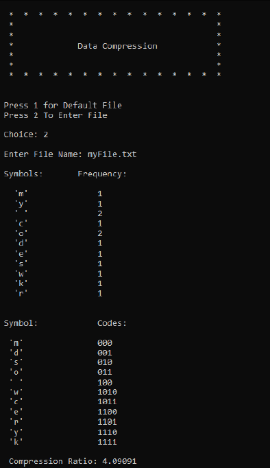

# Data-Compression
Data Structure and Algorithms Lab Project.

Contributors: 
    Muhammad Sallar Bin Aamir
    Muhammad Huzaifa Ilyas

Data Compression:
Data compression is a reduction in the number of bits needed to represent data. Compressing data can save storage capacity, speed up file transfer, and decrease costs for storage hardware and network bandwidth.

# Console - Output

# Basic Build Instructions
1. Clone this repo.
2. Make a Directory
3. Run